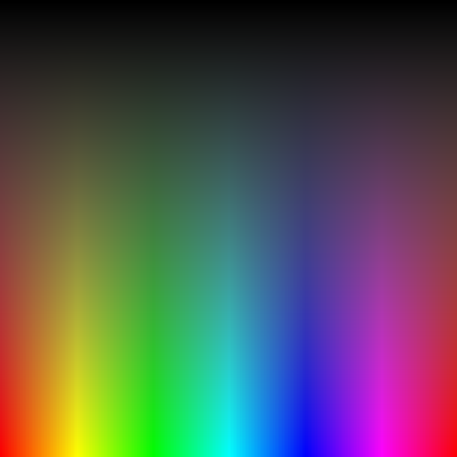

# color

A package for converting from RGB to HSB and back.

* HSB stands for Hue, Saturation and Brightness
* RGB stands for Red, Green and Blue

## Example usage



The above image was generated by the following program:

```go
package main

import (
	hbscolor "github.com/xyproto/color"
	"image"
	"image/png"
	"os"
)

const (
	w = 512
	h = 512
)

func main() {
	// Prepare an image surface
	surface := image.NewRGBA(image.Rectangle{image.Point{0, 0}, image.Point{w, h}})

	// Generate an image that shows a smooth transition over all 360 degrees of hues
	for y := 0; y < h; y++ {
		for x := 0; x < w; x++ {
			c := hbscolor.NewFromFloats(float64(x)/float64(w), float64(y)/float64(h), float64(y)/float64(h), 1.0).RGBA()
			surface.Set(x, y, c)
		}
	}

	// Prepare the image file
	imageFile, err := os.Create("output.png")
	if err != nil {
		panic(err)
	}
	defer imageFile.Close()

	// Write the surface to file, as a PNG image
	png.Encode(imageFile, surface)
}
```

# General info

* License: MIT
* Version: 1.0
* Author: Alexander F Rødseth &lt;xyproto@archlinux.org&gt;
